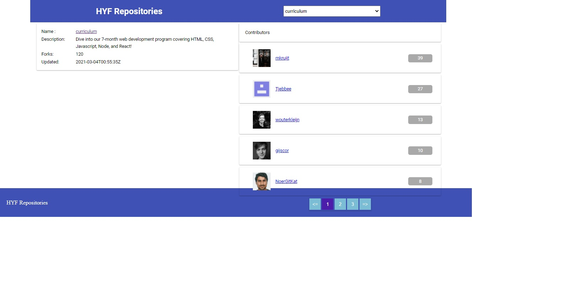

# Hack-your-repo

Vanilla javascript

### Application

#### ES6 + Features

- Arrow Functions
- Template Literals
- Block-Scoped Variables Let and Const
- Fetch function
- async await with try/catch
- Default Parameters
